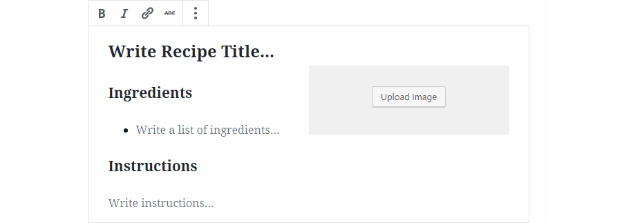

# Recipe Block
Basic recipe block with space for an ingredient list, a set of instructions, and an image.

This is the version without ESNext, the version with it can be found [here](https://github.com/WordPress/gutenberg-examples/tree/master/05-recipe-card-esnext).

## Screenshots
### Editor

### Front-End

## Uses
### Wordpress Packages
These are exposed via `window.wp`.
* [@wordpress/i18n](https://wordpress.org/gutenberg/handbook/packages/packages-i18n/)
* [@wordpress/blocks](https://wordpress.org/gutenberg/handbook/packages/packages-blocks/)
* [@wordpress/element](https://wordpress.org/gutenberg/handbook/packages/packages-element/)
* [@wordpress/editor](https://wordpress.org/gutenberg/handbook/packages/packages-editor/)
* [@wordpress/components](https://wordpress.org/gutenberg/handbook/packages/packages-components/)